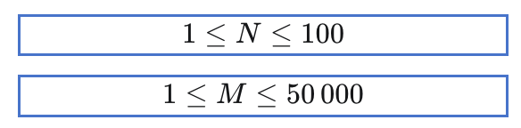
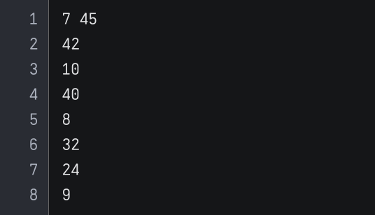

# 동전 계산
엘리스 토끼는 꽉 찬 저금통에 모아둔 동전으로 카페라떼 한 잔을 사러 커피숍에 가려고 합니다.

동전의 종류는 `N`개가 있고, 카페라떼 한 잔의 가격은 `M`원입니다.

엘리스 토끼는 계산을 효율적으로 하기 위해 최소한의 동전 개수만을 사용하여 `M`원에 딱 맞춰 계산하려고 합니다.

이때, 카페라떼 한 잔을 구매하기 위해 필요한 동전의 최소 개수를 구하는 코드를 작성하세요.

단, 저금통에는 각 종류의 동전이 무수히 많다고 가정합니다.

## 입력
각 테스트 케이스는 1초 이내로 수행이 완료되어야 합니다. 제출 시 각 테스트 케이스 실행 후 시간이 초과되지 않으면 별도의 메시지가 출력되지 않으며, **시간이 초과될 경우 "Time Out" 메시지가 출력됩니다**.

- 첫째 줄에 정수 `N`과 `M`이 공백으로 구분되어 입력됩니다. 

- 둘째 줄부터 N개의 줄에 걸쳐 한 줄에 하나씩 각 동전의 가치가 주어집니다.

- 주어진 종류의 동전으로 M원을 맞출 수 없는 경우는 입력되지 않습니다.

## 출력
- `M`원을 만들기 위해 필요한 동전의 최소 개수를 출력합니다.
- 같은 동전을 여러 개 사용할 수 있습니다.

---
### 입력 예시 1

### 출력 예시 1

- 9원짜리 동전 다섯 개로, 카페라떼 한 잔의 가격인 45원을 맞출 수 있습니다.

---

### 입력 예시 2

### 출력 예시 2

- 449원짜리 동전 하나와, 99원짜리 동전 하나로 카페라떼 한 잔의 가격인 548원을 맞출 수 있습니다.

### 주의사항
- 우측 상단의 코드 초기화 버튼을 통해 코드를 초기 상태로 되돌릴 수 있습니다.
