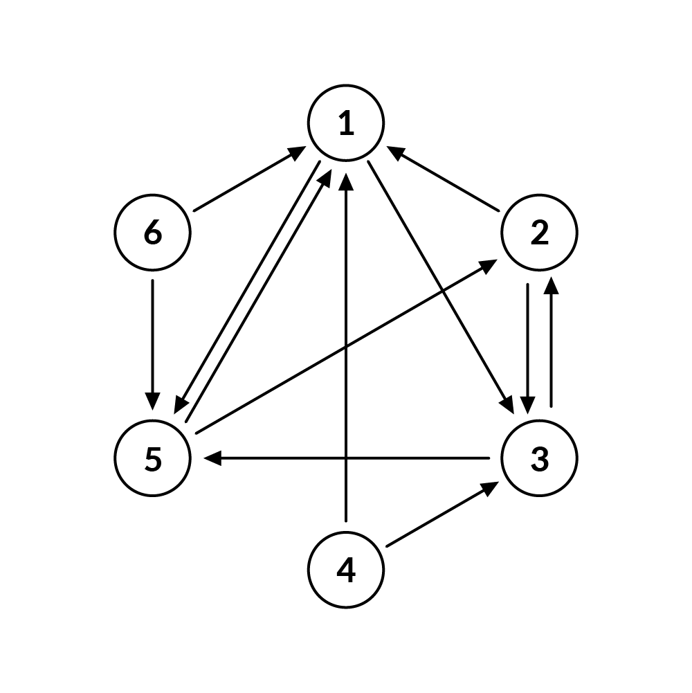
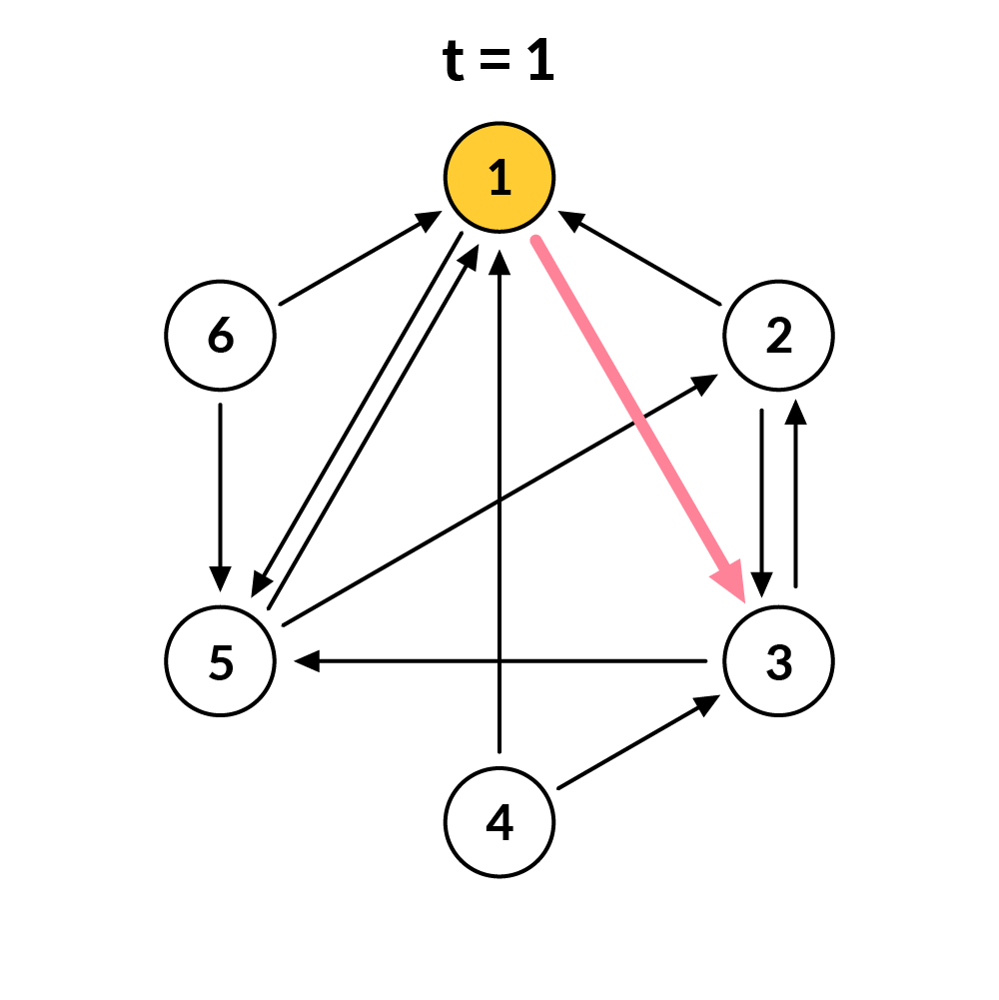
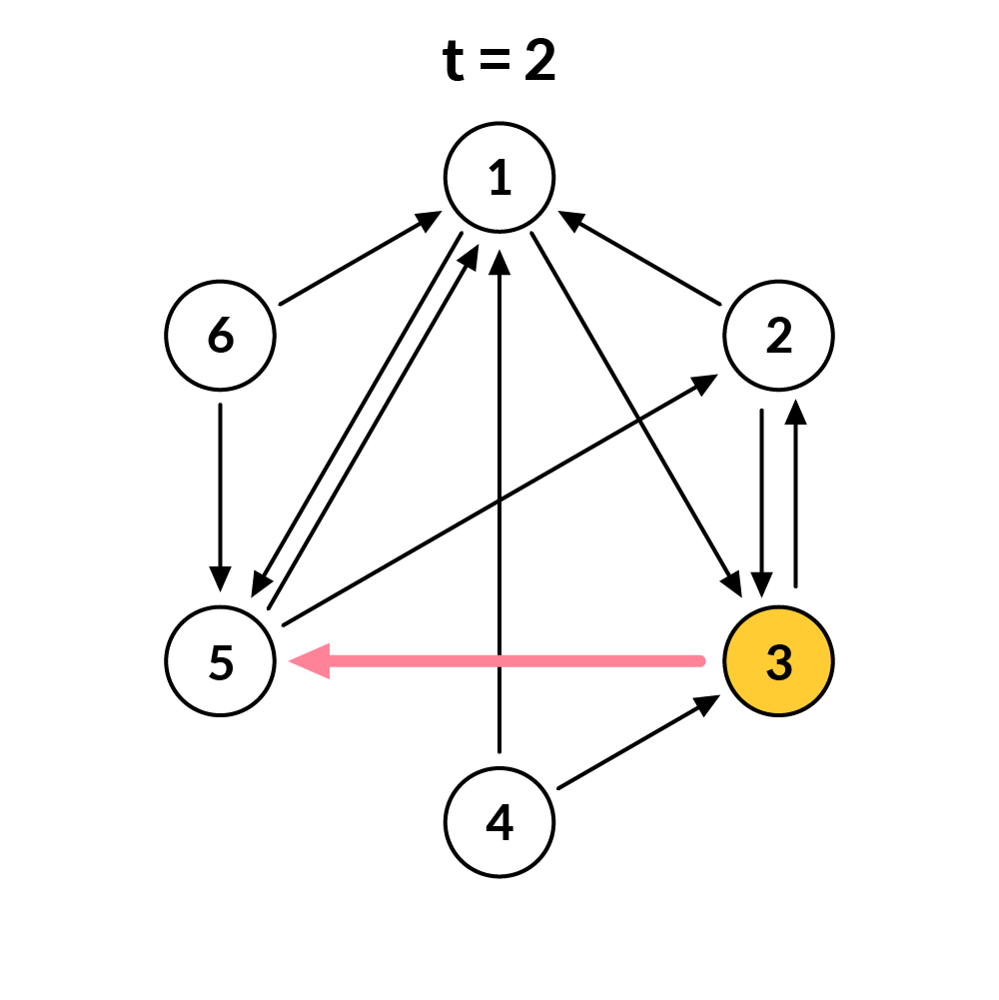
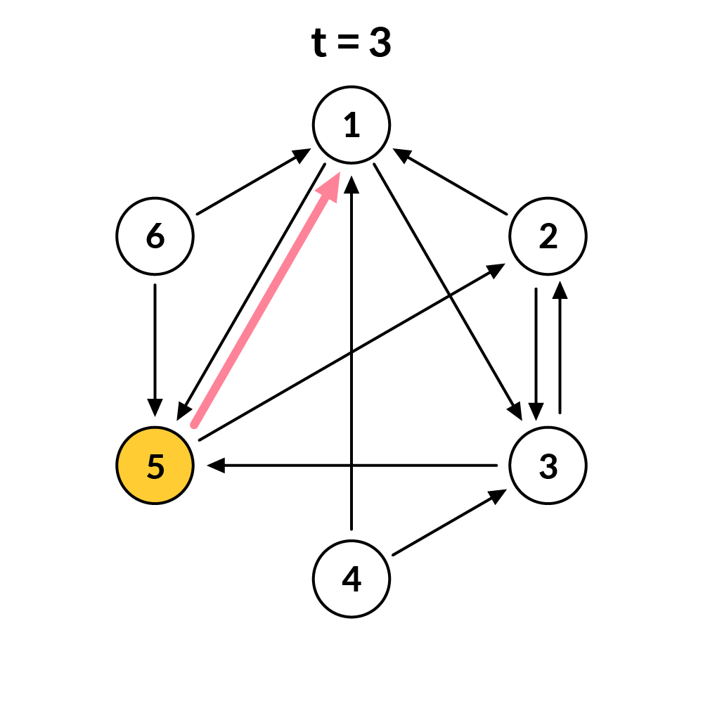
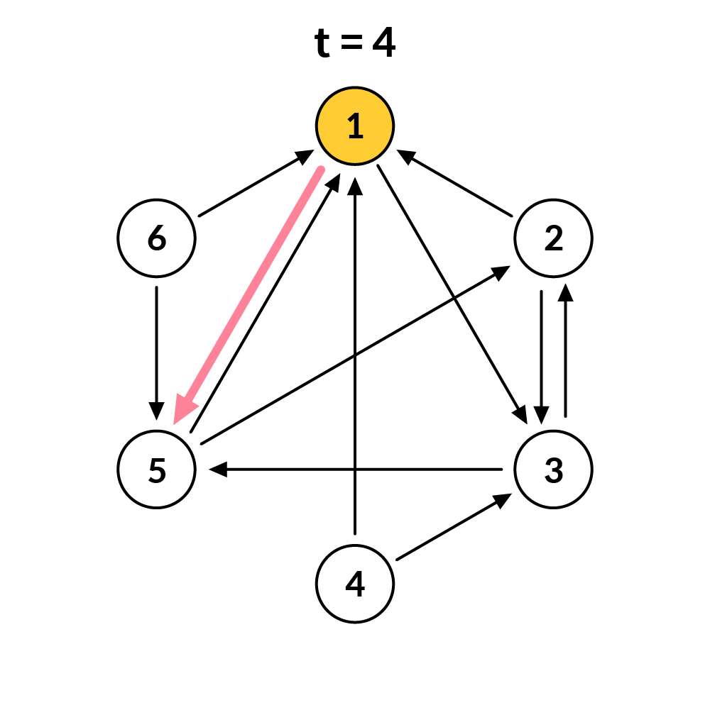
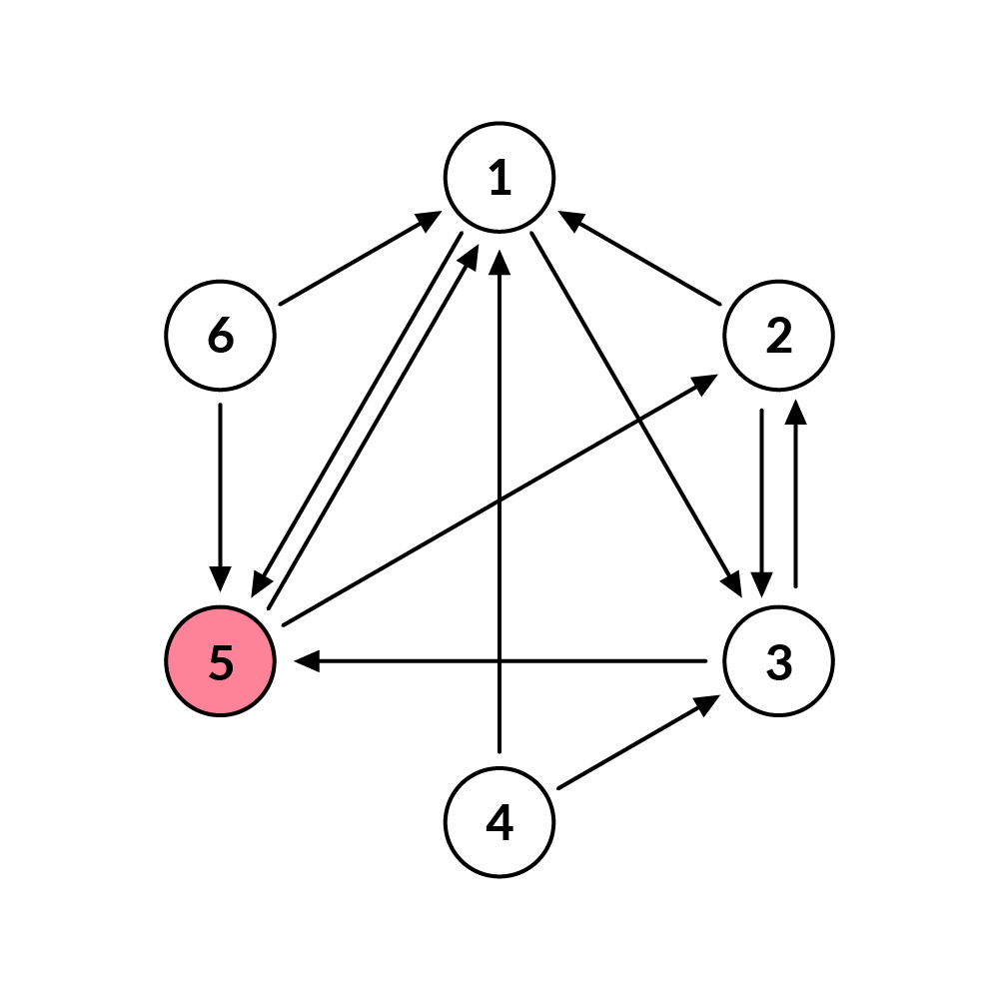
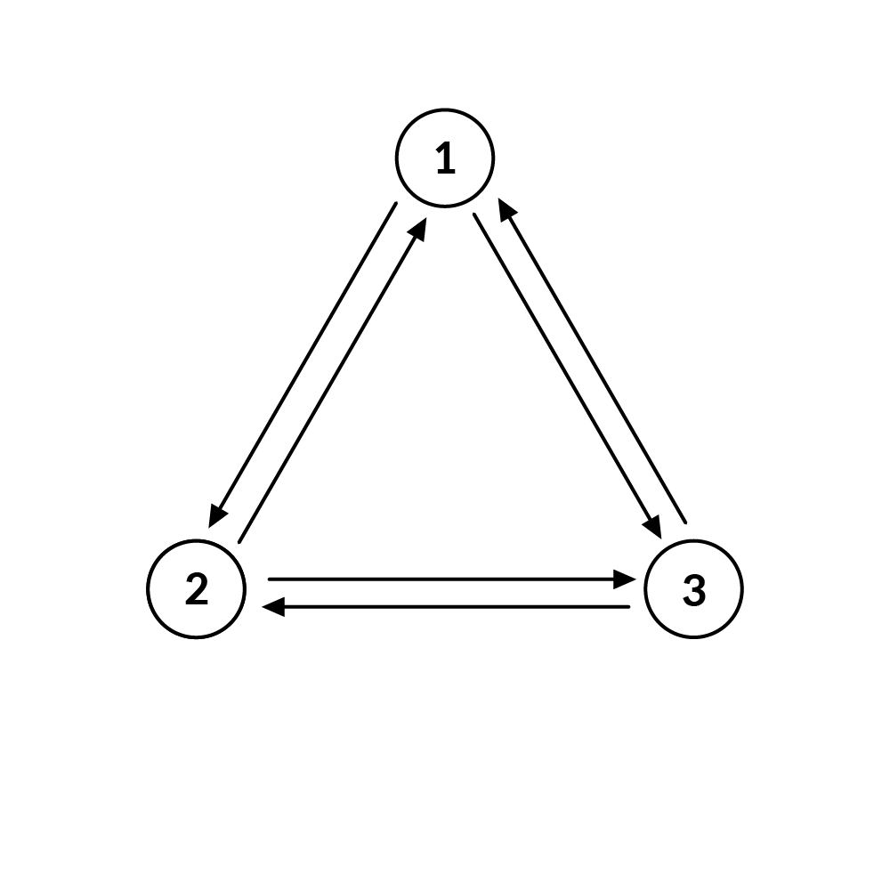
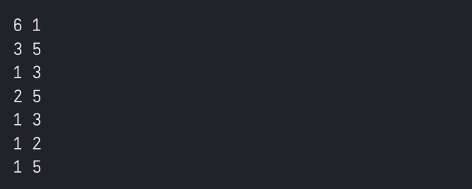

# 화살표 게임
`N`명의 사람이 화살표 게임을 합니다.

화살표 게임이란, 아래와 같은 규칙으로 한 사람을 선택하여, 선택된 사람은 벌칙을 받게 되는 게임입니다.

1. `N`명의 사람 중 한 사람을 술래로 정한다.

2. `N`명의 사람이 왼손과 오른손으로 각각 한 사람씩 지목한다.  
    두 손으로 같은 사람을 지목할 수는 없다.

3. 술래는 특정 숫자를 외친다. 이 숫자를 `t`라고 하자.

4. 술래부터 시작해서 왼손 혹은 오른손 중 한 손을 선택한다. 
    예를 들어, 왼손을 선택할 경우 왼손으로 지목하고 있는 사람이 술래가 되고, 오른손을 선택할 경우 오른손으로 지목하고 있는 사람이 술래가 된다.

5. 다시 3. 의 과정으로 가서 이 과정을 `t`번 반복한다. 
    즉, 술래가 t번 바뀌게 되고, t번째에 술래로 선택되는 사람이 벌칙을 받게 된다.

예를 들어, 아래와 같이 6명의 사람이 있고 각 사람이 왼손과 오른손으로 아래와 같이 다른 사람을 지목했다고 합니다.

이 상황에서 첫 번째 술래가 1번이며, `t = 4` 일 경우 가능한 시나리오는 다음과 같습니다.

이 시나리오는 가능한 한 가지 시나리오이며, 술래로 뽑히는 사람이 왼손 혹은 오른손을 어떻게 선택하느냐에 따라 여러 시나리오가 가능할 수 있습니다.

맨 처음에 술래가 정해지게 되면, t의 크기와 상관없이 절대로 술래로 지목되지 않는 사람이 있습니다.

물론, 첫 번째 단계에서 술래로 지목된 사람도 술래로 포함됩니다.

예를 들어, 위의 예제에서는 4번 사람은 가능한 모든 t에 대해서, 모든 가능한 경우에 대해서 술래로 단 한번도 지목이 되지 않습니다.

마찬가지로 6번 사람 또한 술래로 단 한번도 지목이 되지 않습니다.

다음과 같이 $t \ge N - 1$ 일 때 모든 사람이 술래로 지목될 수 있는 경우도 있습니다.

`N`명이 왼손과 오른손으로 어떤 사람을 가리켰는지와 맨 처음 술래의 번호가 주어졌을 때, 가능한 모든 `t`에 대해서 술래로 단 한번도 지목을 받을 수 없는 사람의 수를 구하는 코드를 작성하세요.

## 입력
각 테스트 케이스는 **1초** 이내로 수행이 완료되어야 합니다. 제출 시 각 테스트 케이스 실행 후 시간이 초과되지 않으면 별도의 메시지가 출력되지 않으며, **시간이 초과될 경우 "Time Out" 메시지가 출력됩니다**.

- 첫 번째 줄에 사람의 수 N, 첫 번째 술래의 번호 K가 주어집니다.

>$3 \le N \le 10000$

>$1 \le K \le N$

- 이후 N개의 줄에 대하여 각 줄에 사람 i의 왼손과 오른손으로 가리킨 사람의 번호 $x_{iL}$, $x_{iR}$ 이 주어집니다.

>$1 \le i \le N$

>$1 \le x_{iL}, x_{iR} \le N$

>$x_{iL} \ne x_{iR}$

- 사람의 번호는 1번부터 시작해서 N번까지 부여됩니다.

## 출력

- 술래로 단 한번도 지목을 받을 수 없는 사람의 수를 출력합니다.

---
### 입력 예시

### 출력 예시

### 주의사항
- 우측 상단의 코드 초기화 버튼을 통해 코드를 초기 상태로 되돌릴 수 있습니다.