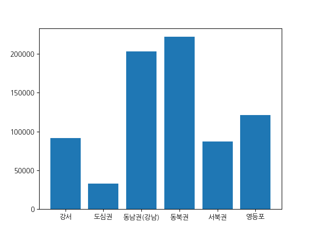

# 서울시 지역 구분별 인구수 비교 및 시각화
2023년 서울시의 지역, 연령별 인구수 데이터를 다양한 그래프를 통해 시각화하고 비교합니다.

`data` 폴더에는 2023년 서울시 지역구별 인구수 데이터가 저장되어 있습니다.

서울시 인구수 데이터가 데이터프레임 형태로 불려와 `df`에 저장되어 있습니다.

서울시의 각 구를 키로, 위치에 따른 지역 구분을 값으로 가지는 딕셔너리 `area`가 있습니다.

아래 지시사항을 따라 데이터를 가공하고 시각화하는 과정을 수행하세요.

## 지시사항
1. 데이터프레임 `df`에 "지역 구분" 컬럼을 생성하고 "지역구"에 해당하는 지역 구분을 문자열로 저장하세요. (지역구와 지역 구분이 저장된 딕셔너리 `area`를 활용하세요)

2. 데이터프레임 `df`에 대해 "지역 구분"을 기준으로 "10대 미만"과 "10대" 컬럼 각각의 **합**을 정리한 데이터프레임을 `df2`에 저장하세요. 

3. `Matplotlib` 라이브러리를 사용해서 `df2`의 "지역 구분" 별 "10대"인구수 총 합을 세로 막대 그래프로 그리세요.

    - A. `plt` 모듈을 사용하여 별도의 변수 없이 바로 막대 그래프를 그리세요. 해당 그래프는 `plt.savefig("plot.png")`로 저장되어 채점됩니다.

    - B. seaborn 라이브러리 사용시 오답처리될 수 있습니다.

4. 실행 버튼을 눌러 올바르게 코드를 작성했는지 확인한 뒤, 제출 버튼을 눌러 제출하세요.<br> 정상적으로 코드를 작성하였다면 우측 상단의 팝업을 통해 그래프를 확인할 수 있습니다.

**[df2 출력 예시] (예시의 숫자는 임의의 숫자입니다)**
```
         10대 미만     10대
지역 구분                  
강서        52366   94577
도심권       24577   33777
동남권(강남)  134745  203747
동북권      153636  225474
서북권       65865   83477
영등포      102745  125648
```

**[그래프 출력 예시] (예시와 똑같은 그래프를 만들어야 합니다)**

### 주의사항

- 그래프 채점을 위해 그래프 제목이나 범주, 축 이름 등은 설정하지 않아야 합니다. `Matplotlib` 라이브러리의 기본 설정만 사용하여 그래프 출력 예시와 동일한 막대 그래프를 출력하세요.

- 지시사항에서 명시한 부분 외에 스켈레톤 코드를 임의로 삭제하거나 수정할 경우, 혹은 명시된 변수명 또는 함수명을 사용하지 않을 경우 정상적으로 채점이 되지 않을 수 있습니다. 반드시 지시사항을 확인해주세요.

- 우측 상단의 코드 초기화 버튼을 통해 코드를 초기 상태로 되돌릴 수 있습니다.