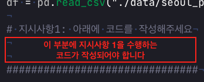
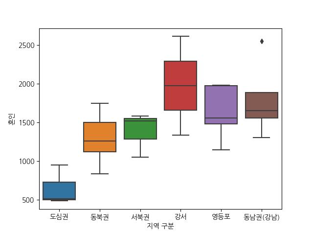
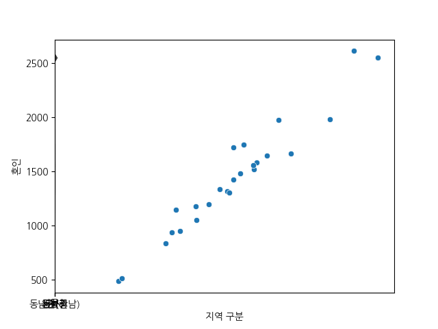
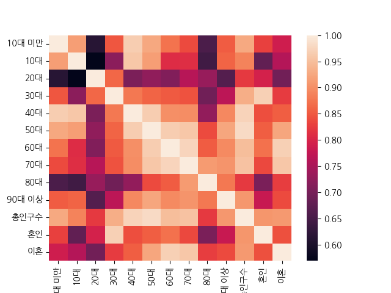

# 다양한 그래프를 활용한 서울시 지역 구분별 인구수 시각화
data 폴더에는 2023년 서울시 지역구별 인구수 및 혼인 데이터가 저장되어 있습니다. 해당 데이터는 데이터프레임 형태로 불려와 df에 저장되어 있습니다.

아래 지시사항을 따라 다양한 그래프를 활용해 데이터를 시각화 하세요. 본 문항에서 지시사항의 모든 그래프는 seaborn 라이브러리를 활용해 그려야 합니다.

- 본 문항은 각 지시사항에 해당하는 **코드를 작성해야 하는 부분이 정해져있는 문항입니다**. 스켈레톤코드의 주석을 참고하여 코드를 작성해 주세요.

- 예시

## 지시사항
1. 데이터프레임 `df`를 활용해 x축 "지역 구분"별 y축 "혼인" 건수를 나타내는 박스 그래프를 그리는 코드를 작성하세요.

2. 데이터프레임 `df`를 활용해 x축 "30대" 와 y축 "혼인" 의 관계를 나타내는 산점도를 그리는 코드를 작성하세요. 

3. 데이터프레임 `df`의 숫자로 되어있는 열간의 상관계수들을 `df_corr`에 저장하세요. 이후 `df_corr`을 활용해 히트맵을 그리는 코드를 작성하세요.

**[그래프 출력 예시](예시와 똑같은 그래프를 만들어야 합니다)**

4. 실행 버튼을 눌러 올바르게 코드를 작성했는지 확인한 뒤, 제출 버튼을 눌러 제출하세요. 정상적으로 코드를 작성하였다면 우측 상단의 팝업을 통해 그래프를 확인할 수 있습니다.

### 주의사항
- 그래프 채점을 위해 그래프 제목이나 범주, 축 이름 등은 설정하지 **않아야** 합니다. `seaborn` 라이브러리의 기본 설정만 사용하여 그래프 출력 예시와 동일한 막대 그래프를 출력하세요.

- 지시사항에서 명시한 부분 외에 스켈레톤 코드를 임의로 삭제하거나 수정할 경우, 혹은 명시된 변수명 또는 함수명을 사용하지 않을 경우 정상적으로 채점이 되지 않을 수 있습니다. 반드시 지시사항을 확인해주세요.

- 우측 상단의 코드 초기화 버튼을 통해 코드를 초기 상태로 되돌릴 수 있습니다.
