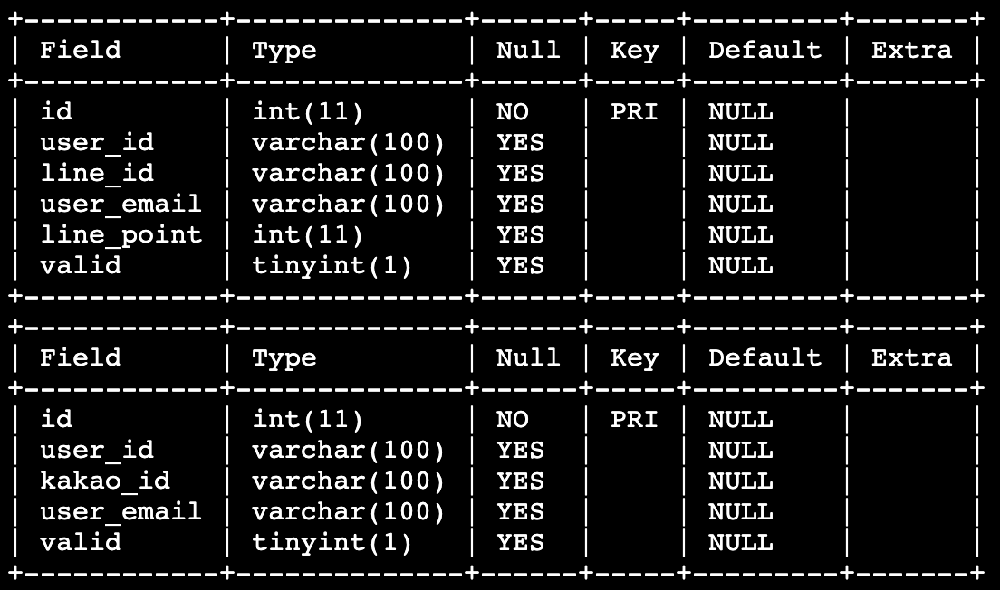

# 소셜 로그인 사용자
엘리스 닷컴에서는 2가지의 소셜 로그인을 지원하여 각 유저 정보에 대해서 `USER_LINE` 테이블과 `USER_KAKAO` 테이블에 저장하고 있습니다.

소셜 로그인을 통해서 **정상적으로 가입된 유저 정보**를 추출하기 위해서, 각 테이블에 대해 **valid가 true인 유저의 유저 ID(user_id)와 이메일(user_email) 정보를 추출**하려고 합니다.

2개의 소셜 로그인 중 하나라도 정상적으로 가입된 유저의 유저 ID(user_id)와 이메일(user_email)정보에 대해서 중복을 제거하여 함께 출력해봅시다.

`USER_LINE` 테이블과 `USER_KAKAO` 테이블은 아래와 같이 구성되어있습니다.

## 지시사항
`USER_LINE` 테이블과 `USER_KAKAO` 테이블에서 각각 **valid가 true인 유저**의 **유저 ID(user_id), 유저 이메일(user_email)** 을 조회하고 이를 집합 연산자로 연결하여 출력하세요. 이때 **중복데이터는 제거**되는 집합 연산자를 이용하세요.

### 주의사항
- valid 컬럼의 데이터 타입은 bool값이기 때문에 'true'가 아닌, TRUE로 비교해주세요.
- 결과에 대해 `ORDER BY` 를 이용하여 유저 ID를 기준으로 오름차순 정렬을 해주세요.
- 데이터 조회순서는 지시사항에서 언급하고 있는 순서대로 정확히 작성하세요.