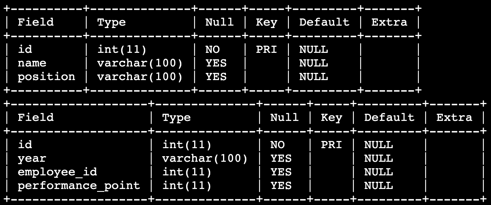

# 실적에 따라 순위 매기기
`EMPLOYEE` 테이블에는 직원의 ID, 이름, 직급 정보가 담겨있습니다.

`EMPLOYEE_PERFORMANCE` 테이블에는 ID, 년도, 직원 ID, 성과 포인트 정보가 담겨 있습니다.

**2020년도의 성과 포인트를 기준으로 점수가 높은 사람부터 순위**를 매겨 조회하려고 합니다.

이때 동일한 성과 포인트에 대해서는 동일 순위로 생각하되, 단건으로 취급하려고 합니다.

**두 개의 테이블을 결합**하고, **성과 포인트를 기준**으로 순위를 매겨 **순위(rank), 이름(name), 직급(position), 년도(year), 성과 포인트(performance_point)** 를 조회하세요.

`EMPLOYEE` 테이블과 `EMPLOYEE_PERFORMANCE` 테이블은 아래와 같이 구성되어있습니다.

## 지시사항
`EMPLOYEE` 테이블의 **id**와 `EMPLOYEE_PERFORMANCE` 테이블의 **employee_id**를 통해 두 테이블을 결합하고, **년도(year)가 2020인 데이터**에 대해서 성과 포인트(performance_point) 내림차순 기준으로 순위를 매겨 **순위(rank), 이름(name), 직급(position), 년도(year), 성과 포인트(performance_point)** 정보를 출력하세요.

이때, 동일 값에 대해서는 동일한 순위를 매기지만 단건으로 취급합니다.

### 주의사항
- year 컬럼의 데이터 타입은 숫자형이 아닌, 문자형입니다.
- 결과에 대해 `ORDER BY` 를 이용하여 순위 오름차순, 이름 오름차순 기준으로 정렬을 해주세요.
- 데이터 조회순서는 지시사항에서 언급하고 있는 순서대로 정확히 작성하세요.