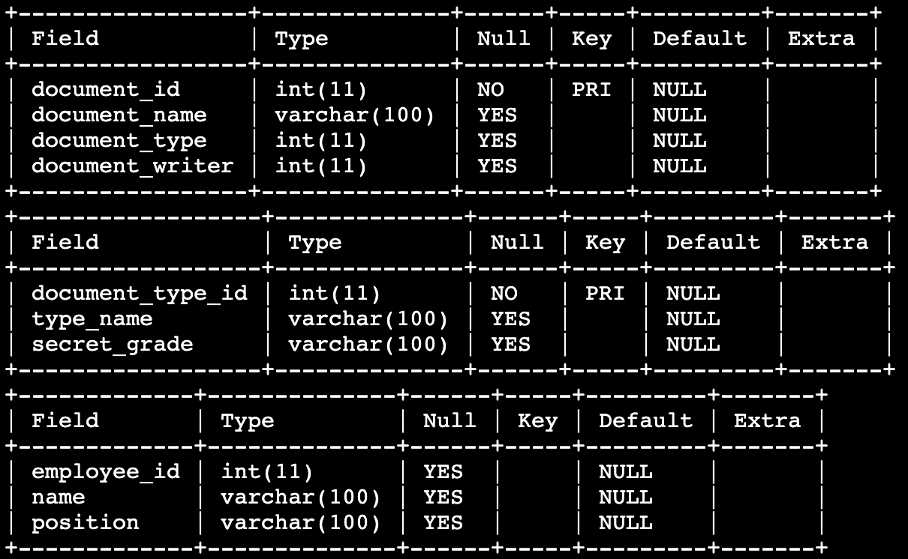

# 기밀문서 분류하기
`DOCUMENT` 테이블에는 문서 ID, 문서 이름, 문서 타입, 문서 작성자 정보가 담겨있고 `DOCUMENT_TYPE` 테이블에는 문서 타입 ID, 문서 타입 이름, 기밀 등급 정보가 담겨 있으며 `EMPLOYEE` 테이블에는 직원 ID, 이름, 직급 정보가 담겨 있습니다.

회사에서는 기밀 등급이 'Top Secret'인 문서 중 '사원' 직급이 작성한 문서를 찾고자 합니다. 이때 `DOCUMENT` 테이블에는 타입 코드에 대한 ID와 작성자에 대한 직원 ID 정보만 있기 때문에 다른 두 개의 테이블과의 적절한 결합이 필요합니다.

`DOCUMENT` 테이블에 대해 `DOCUMENT_TYPE` 테이블과 `EMPLOYEE` 테이블을 JOIN하여 **기밀 등급(secret_grade)이 'Top Secret'이면서 작성자의 직급(position)이 '사원'** 인 데이터를 조회해봅시다.

`DOCUMENT` 테이블과 `DOCUMENT_TYPE` 테이블, `EMPLOYEE` 테이블은 아래와 같이 구성되어있습니다.

## 지시사항
`DOCUMENT` 테이블의 **document_type**과 `DOCUMENT_TYPE` 테이블의 **document_type_id** 를 이용하여 JOIN하고, `DOCUMENT` 테이블의 **document_writer**와 `EMPLOYEE` 테이블의 **employee_id**를 이용하여 JOIN 을 합니다.
이후 WHERE문을 이용하여 **기밀 등급(secret_grade)이 'Top Secret'이고 작성자 직급(position)이 '사원'인 문서**에 대해서, **문서 ID(document_id), 문서 이름(document_name), 작성자 이름(name), 문서 타입 이름(type_name), 기밀 등급(secret_grade)** 을 조회해봅시다.

### 주의사항
- 결과에 대해 `ORDER BY` 를 이용하여 문서 ID를 기준으로 오름차순 정렬을 해주세요.
- 데이터 조회순서는 지시사항에서 언급하고 있는 순서대로 정확히 작성하세요.