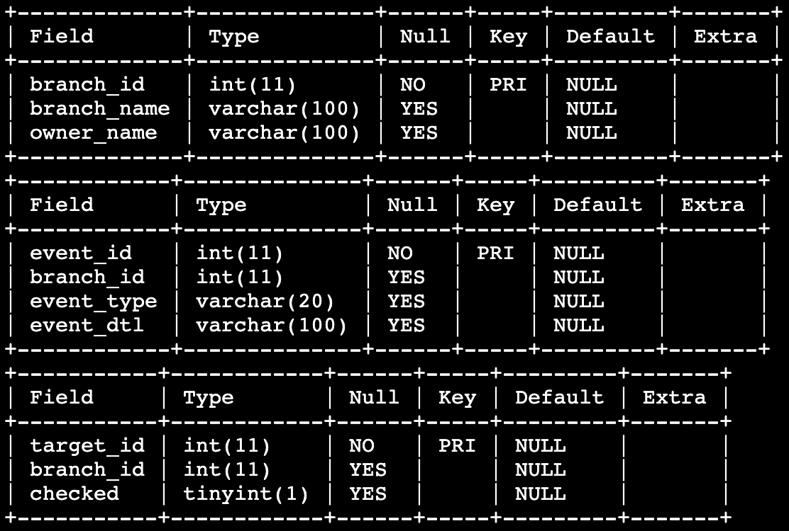

# 분점들의 이벤트
`BRANCH` 테이블에는 분점 ID, 분점 이름, 소유주 이름 정보가 담겨 있으며 `EVENT_HISTORY` 테이블에는 이벤트 ID, 분점 ID, 이벤트 타입, 이벤트 상세 정보가 담겨 있고 `TARGET_BRANCH` 테이블에는 타겟 ID, 분점 ID, 체크여부 정보가 담겨 있습니다.

`TARGET_BRANCH`를 통해 아직 체크되지 않은(checked = false) 분점에 대해서 'sale' 타입의 이벤트를 진행한 분점의 정보를 출력하고자 합니다.

이를 통해 지시사항에서 요구하는 정보를 출력하세요.
BRANCH 테이블, `EVENT_HISTORY` 테이블, `TARGET_BRANCH` 테이블은 아래와 같이 구성되어있습니다.

## 지시사항

`BRANCH` 테이블을 `EVENT_HISTORY` 테이블과 `JOIN`하고 `WHERE` 문을 통해서, **이벤트 타입(event_type)이 'sale'이고 분점 ID가 체크되지 않은 분점 ID들에 속하는지에 대한 조건**을 걸어서 **분점 ID(branch_id), 분점 이름(branch_name), 소유주 이름(owner_name), 이벤트 타입(event_type), 이벤트 상세(event_dtl)** 정보를 출력하세요.

이때, **체크되지 않은 분점 ID**들 에 대한 값은 `비연관 서브쿼리`를 이용하세요.

### 주의사항
- checked 컬럼의 데이터 타입은 bool값이기 때문에 'false'가 아닌 FALSE로 비교해주세요.
- 결과에 대해 `ORDER BY` 를 이용하여 분점 ID를 기준으로 오름차순 정렬을 해주세요.
- 데이터 조회순서는 지시사항에서 언급하고 있는 순서대로 정확히 작성하세요.