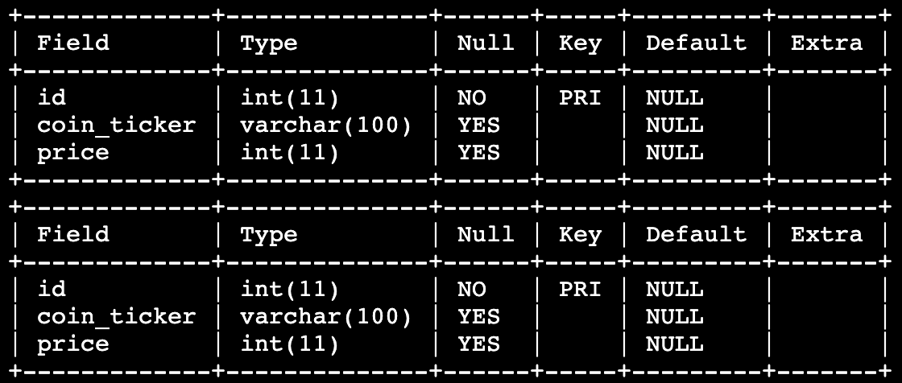

# 코인 가격 차이
`KOREA_EXCHANGE` 테이블과 `JAPAN_EXCHANGE` 테이블에는 서로 동일하게 ID, 코인 티커, 가격 정보가 담겨 있습니다.

한국 거래소와 일본 거래소에서 코인 티커가 동일하지만, 한국 거래소의 가격이 더 저렴하거나 같은 코인의 정보를 출력해봅시다.

`KOREA_EXCHANGE` 테이블과 `JAPAN_EXCHANGE` 테이블은 아래와 같이 구성되어있습니다.

## 지시사항
`KOREA_EXCHANGE` 테이블과 `JAPAN_EXCHANGE` 테이블에 대해서 연관 서브쿼리 개념을 활용하여, **코인 티커는 일치하지만 한국 거래소의 가격이 더 싸거나 같은 코인**에 대해서 **코인 티커(coin_ticker), 가격(price)** 정보를 출력하세요.

### 주의사항
- 결과에 대해 `ORDER BY` 를 이용하여 코인 티커를 기준으로 오름차순 정렬을 해주세요.
- 데이터 조회순서는 지시사항에서 언급하고 있는 순서대로 정확히 작성하세요.