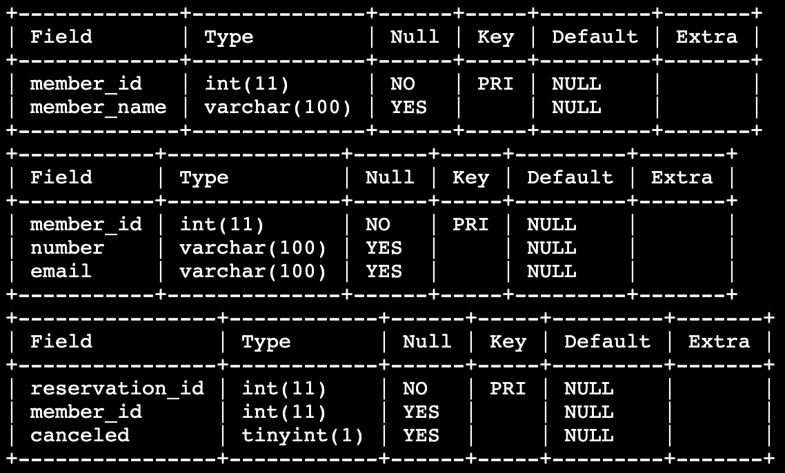

# 예약자 상세정보
엘리스 단체에서는 멤버들의 정보와 예약 정보를 따로 관리하고 있습니다.

`MEMBER` 테이블에는 멤버 ID와 멤버 이름 정보를 저장하고, `MEMBER_DTL` 테이블에는 멤버 ID와 전화번호, 이메일 정보를 저장하며, `RESERVATION` 테이블에는 예약 ID, 멤버 ID, 취소 여부 정보를 저장하고 있습니다.

멤버들의 상세 정보를 조회하되 예약을 취소하지 않은 멤버들의 정보만 조회하고자 합니다.
`INNER JOIN`과 `EXISTS`를 활용하여 지시사항에서 요구하는 정보를 출력하세요.

`MEMBER` 테이블, `MEMBER_DTL` 테이블, `RESERVATION` 테이블은 아래와 같이 구성되어있습니다.

## 지시사항
멤버들의 상세정보를 조회하기 위해서 `MEMBER` 테이블과 `MEMBER_DTL` 테이블을 **member_id**로 `INNER JOIN`을 실시하고 `WHERE`문과 `EXISTS`를 활용하여 `RESERVATION` 테이블에 **member_id가 일치하고 취소 여부(canceled)가 false인 데이터가 존재하는** 멤버에 대해서, **멤버 ID(member_id), 멤버 이름(member_name), 전화번호(number), 이메일(email)** 을 출력해봅시다.

### 주의사항
- 결과에 대해 `ORDER BY` 를 이용하여 멤버 ID를 기준으로 오름차순 정렬을 해주세요.
- 데이터 조회순서는 지시사항에서 언급하고 있는 순서대로 정확히 작성하세요.