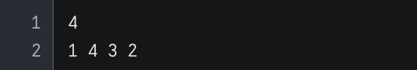

# 빌딩
서울 선릉에는 수많은 빌딩들이 있습니다.

엘리스 토끼는 선릉에서 일렬로 세워진 빌딩들을 보았습니다.

하지만, 일렬로 세워진 빌딩을 옆에서 보니, 일부 빌딩들만 보인다는 것을 깨달았습니다. 

일렬로 세워진 빌딩들의 개수와 높이 정보가 주어지고, 엘리스 토끼가 이 빌딩들을 왼쪽과 오른쪽에서 볼 때 각각 몇 개의 빌딩들이 보이게 될지 확인하는 코드를 작성하세요.

## 입력
각 테스트 케이스는 1초 이내로 수행이 완료되어야 합니다. 제출 시 각 테스트 케이스 실행 후 시간이 초과되지 않으면 별도의 메시지가 출력되지 않으며, **시간이 초과될 경우 "Time Out" 메시지가 출력됩니다**.

- 첫째 줄에 일렬로 세워진 빌딩들의 수 N이 주어집니다. 

- 둘째 줄에 빌딩 N개의 높이(h)가 공백으로 구분되어 주어집니다. 

## 출력
- 엘리스 토끼가 왼쪽에서 빌딩들을 보았을 때 보게 될 빌딩들의 개수와, 오른쪽에서 빌딩들을 보았을 때 보게 될 빌딩들의 개수를 공백으로 구분하여 출력합니다.

- 보는 방향에서 높이가 더 높거나 같은 빌딩에 가려지면 가려진 건물은 보이지 않습니다.

---
### 입력 예시 1

### 출력 예시 1

- 엘리스 토끼가 왼쪽에서 빌딩들을 보게 된다면 높이가 1인 첫 번째 빌딩과 높이가 4인 두 번째 빌딩만 볼 수 있게 됩니다.

- 높이가 3인 세 번째 빌딩과 높이가 2인 네 번째 빌딩은 높이가 4인 두 번째 빌딩에 막혀 보이지 않습니다. 

- 같은 방식으로 엘리스 토끼가 오른쪽에서 빌딩들을 보게 된다면, 3개의 빌딩이 보이게 됩니다.
---
### 입력 예시 2

### 출력 예시 2

- 이때 엘리스 토끼가 빌딩들을 왼쪽에서 본다면, 첫 번째 빌딩 하나만, 오른쪽에서 본다면 모든 빌딩을 볼 수 있습니다.

### 주의사항
- 우측 상단의 코드 초기화 버튼을 통해 코드를 초기 상태로 되돌릴 수 있습니다.